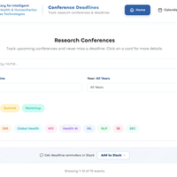
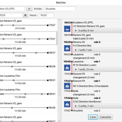
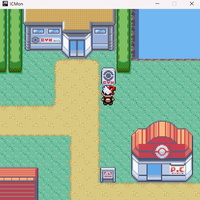

<!-- ============ HEADER ============ -->
<p align="center">
  
</p>

---

## About me

```ts
const azo = {
  name: "Omar Ziyad Azgaoui",
  role: "CS student @ EPFL",
  location: "Lausanne, CH 🇨🇭",

  stack: ["TypeScript", "React", "Python", "Java"],
  loves: ["clean UIs", "messy ideas", "elegant backends"],

  currentlyLearning: ["German B1 -> B2", "system design"],
  currentlyBuilding: "// see pinned repos below",

  afk: ["surfing 🌊", "climbing 🧗", "volleyball 🏐"],
  motto: "learn fast, ship faster",
} as const;
```

---

## Tech toolbox

**Core languages**
<p>
  <a href="https://www.java.com/"></a>
  <a href="https://www.python.org/"></a>
  <a href="https://www.typescriptlang.org/"></a>
  <a href="https://developer.mozilla.org/docs/Web/JavaScript"></a>
</p>

**Web and frameworks**
<p>
  <a href="https://react.dev/"></a>
  <a href="https://nodejs.org/"></a>
  <a href="https://developer.mozilla.org/docs/Web/HTML"></a>
  <a href="https://developer.mozilla.org/docs/Web/CSS"></a>
</p>

**Backend and data**
<p>
  <a href="https://firebase.google.com/"></a>
  <a href="https://www.convex.dev/"></a>
</p>

**Tools I live in**
<p>
  <a href="https://git-scm.com/"></a>
  <a href="https://www.kernel.org/linux/"></a>
  <a href="https://code.visualstudio.com/"></a>
</p>

---

## Featured projects

<table>
<tr>
<td width="50%" valign="top">

<a href="https://github.com/swiss-ai/mmore">
  
</a>

#### [`swiss-ai/mmore`](https://github.com/swiss-ai/mmore)
Multimodal document processing pipeline at scale.
<sub>**Python** · contributor at Swiss AI Initiative</sub>

</td>
<td width="50%" valign="top">

<a href="https://github.com/EPFLiGHT/LiGHT-Conferences-Calendar">
  
</a>

#### [`EPFLiGHT/LiGHT-Conferences-Calendar`](https://github.com/EPFLiGHT/LiGHT-Conferences-Calendar)
Conference deadline tracker for the LiGHT lab. Search, sort, Slack reminders.
<sub>**TypeScript / React** · contributor at EPFL LiGHT</sub>

</td>
</tr>
<tr>
<td width="50%" valign="top">

<a href="https://github.com/AZOGOAT/ReCHor">
  
</a>

#### [`AZOGOAT/ReCHor`](https://github.com/AZOGOAT/ReCHor)
Swiss public transport route planner. Multi-leg journeys, transfers, real schedules.
<sub>**Java** · personal project</sub>

</td>
<td width="50%" valign="top">

<a href="https://github.com/AZOGOAT/ICMonGame">
  
</a>

#### [`AZOGOAT/ICMonGame`](https://github.com/AZOGOAT/ICMonGame)
A Pokémon-inspired RPG built from scratch. Tile-based world, sprite engine, combat system.
<sub>**Java** · personal project</sub>

</td>
</tr>
</table>

> 🔒 **Private contributions** - also active on private repos with research labs and partner orgs. Happy to walk through the work in interviews or DMs.

---

## GitHub stats

<p align="center">
  <picture>
    <source media="(prefers-color-scheme: dark)" srcset="https://raw.githubusercontent.com/AZOGOAT/AZOGOAT/output/github-contribution-grid-snake-dark.svg" />
    <source media="(prefers-color-scheme: light)" srcset="https://raw.githubusercontent.com/AZOGOAT/AZOGOAT/output/github-contribution-grid-snake.svg" />
    
  </picture>
</p>

---

## Connect with me

<a href="https://azogoat.github.io/Portfolio"></a>
<a href="https://www.linkedin.com/in/omar-ziyad-azgaoui/"></a>
<a href="https://github.com/AZOGOAT"></a>

---

<!-- ============ FOOTER ============ -->
<p align="center">
  
</p>
