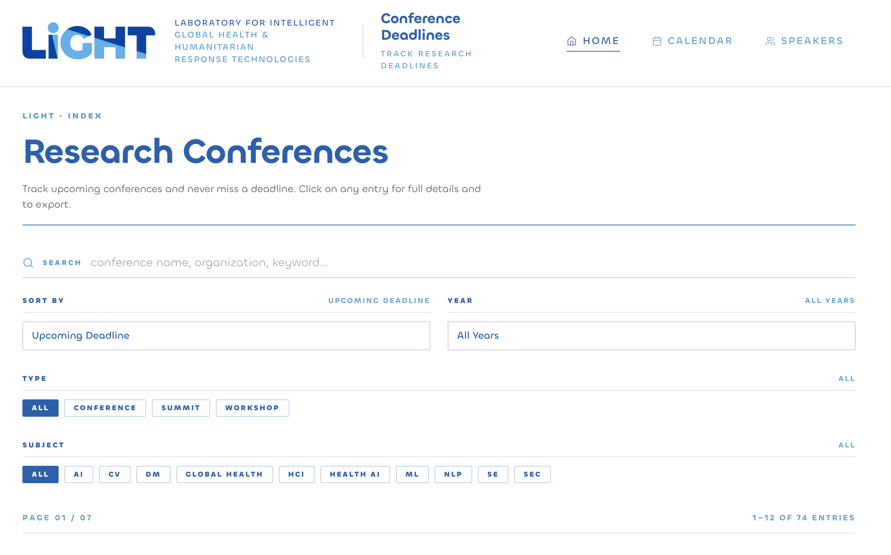
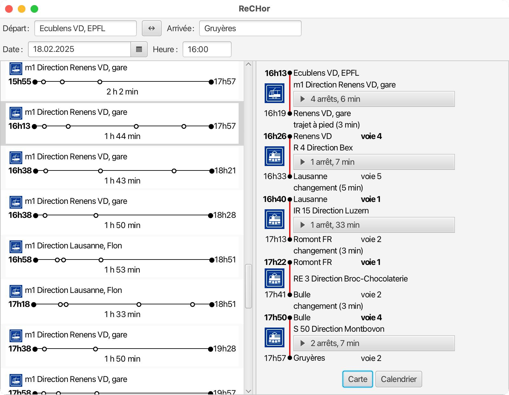
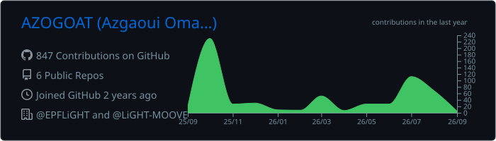

<!-- ============ HEADER ============ -->
<p align="center">
  
</p>

<p align="center">
  <a href="https://github.com/AZOGOAT">
    
  </a>
</p>

---

## About me

```ts
const azo = {
  name: "Omar Ziyad Azgaoui",
  role: "CS student @ EPFL",
  workingWith: "LiGHT lab (EPFL x Harvard), AI for global health",
  location: "Lausanne, CH 🇨🇭",

  loves: ["clean UIs", "messy ideas", "elegant backends"],

  currentlyBuilding: "reviewer-two, an AI PR reviewer",
  currentlyLearning: ["German B1 -> B2", "system design"],

  afk: ["surfing 🌊", "climbing 🧗", "volleyball 🏐"],
  motto: "learn fast, ship faster",
} as const;
```

---

## Tech toolbox

**Core languages**
<p>
  <a href="https://www.java.com/"></a>
  <a href="https://www.python.org/"></a>
  <a href="https://www.typescriptlang.org/"></a>
  <a href="https://developer.mozilla.org/docs/Web/JavaScript"></a>
</p>

**Web and frameworks**
<p>
  <a href="https://react.dev/"></a>
  <a href="https://nodejs.org/"></a>
  <a href="https://developer.mozilla.org/docs/Web/HTML"></a>
  <a href="https://developer.mozilla.org/docs/Web/CSS"></a>
</p>

**Backend and data**
<p>
  <a href="https://firebase.google.com/"></a>
  <a href="https://www.convex.dev/"></a>
</p>

**Tools I live in**
<p>
  <a href="https://git-scm.com/"></a>
  <a href="https://www.kernel.org/linux/"></a>
  <a href="https://code.visualstudio.com/"></a>
</p>

---

## Featured projects

<table>
<tr>
<td width="50%" valign="top">

<a href="https://github.com/EPFLiGHT/LiGHT-Conferences-Calendar">
  
</a>

#### [`EPFLiGHT/LiGHT-Conferences-Calendar`](https://github.com/EPFLiGHT/LiGHT-Conferences-Calendar)
Research conference deadline tracker: calendar, countdowns, ICS export, Slack reminders.
<sub>**TypeScript / React** · core contributor at EPFL LiGHT</sub>

</td>
<td width="50%" valign="top">

<a href="https://github.com/AZOGOAT/reviewer-two">
  
</a>

#### [`AZOGOAT/reviewer-two`](https://github.com/AZOGOAT/reviewer-two)
AI PR reviewer that posts real GitHub reviews. Request it like a human reviewer.
<sub>**TypeScript** · personal project</sub>

</td>
</tr>
<tr>
<td width="50%" valign="top">

<a href="https://github.com/EPFLiGHT/mmore">
  
</a>

#### [`EPFLiGHT/mmore`](https://github.com/EPFLiGHT/mmore)
Scalable multimodal pipeline for processing, indexing and querying documents.
<sub>**Python** · contributor at Swiss AI Initiative / EPFL LiGHT</sub>

</td>
<td width="50%" valign="top">

<a href="https://github.com/AZOGOAT/ReCHor">
  
</a>

#### [`AZOGOAT/ReCHor`](https://github.com/AZOGOAT/ReCHor)
Swiss public transport route planner. Multi-leg journeys, transfers, real schedules.
<sub>**Java** · personal project</sub>

</td>
</tr>
</table>

> 🔒 **Private contributions** - most of my day-to-day work lives in private repos: MOOVE (EPFL LiGHT) and other partner-org projects. Happy to walk through it in interviews or DMs.

---

## GitHub stats

<p align="center">
  <a href="https://github.com/vn7n24fzkq/github-profile-summary-cards">
    
  </a>
</p>

<p align="center">
  
</p>

<p align="center">
  <sub>📊 Stats reflect <b>public repositories only</b> - private and partner-org work isn't counted here.</sub>
</p>

---

## Connect with me

<a href="https://azogoat.github.io/Portfolio"></a>
<a href="https://www.linkedin.com/in/omar-ziyad-azgaoui/"></a>
<a href="https://github.com/AZOGOAT"></a>

---

<p align="center">
  <picture>
    <source media="(prefers-color-scheme: dark)" srcset="https://raw.githubusercontent.com/AZOGOAT/AZOGOAT/output/github-contribution-grid-snake-dark.svg" />
    <source media="(prefers-color-scheme: light)" srcset="https://raw.githubusercontent.com/AZOGOAT/AZOGOAT/output/github-contribution-grid-snake.svg" />
    
  </picture>
</p>

<!-- ============ FOOTER ============ -->
<p align="center">
  
</p>
